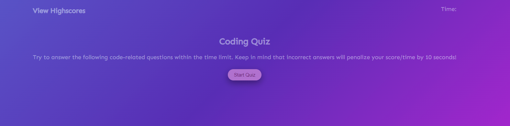

# <04 Code Quiz>

## Description

GIVEN I am taking a code quiz
WHEN I click the start button
THEN a timer starts and I am presented with a question
WHEN I answer a question
THEN I am presented with another question
WHEN I answer a question correctly there is an alert "Correct!"
WHEN I answer a question incorrectly there is an alert "Wrong!"
THEN time is subtracted from the clock
WHEN all questions are answered or the timer reaches 0
THEN the game is over
WHEN the game is over
THEN I can save my initials and my score and time

## Table of Contents

- [Installation](#installation)
- [Usage](#usage)
- [Credits](#credits)
- [License](#license)
- [Features](#features)
- [How to Contribute](#how-to-contribute)
- [Tests](#tests)

## Installation

N/A

## Usage

Here is the link: https://gisellerx.github.io/code-quiz/ 

## Credits

Giselle Reyes, Professor Phillip Loy who made a video guide for the quiz, Quentin Jones the TA that helped with some of the highscore section

## License

## Features

Website

## How to Contribute

Personal challenge

## Tests

Used VS Code